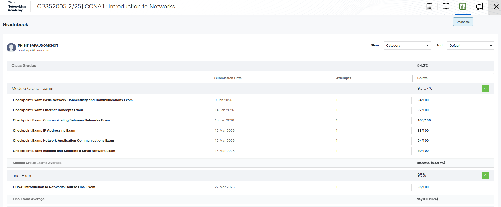

# Network-Portfolio

CP352005  Computer Networks Portfolio

นายพิสิษฐ์ ทรัพย์อุดมโชติ รหัสนักศึกษา 673380285-2 Section 01

Email : phisit.sap@kkumail.com

## Portfolio – Networks

This repository contains my assignments, labs, projects, and certificates related to Computer Networks and Network Programming.

---

## 📄 Personal Assignment

| Assignment | Document Link | PDF File |
|---|---|---|
| Assignment 1 (Essay) | [Essay](https://docs.google.com/document/d/1tDspMEMAvq2EnK2olRzvEqZ8rqw8Sl06u4rAo-bAwhU/edit?usp=sharing) | [Essay pdf](./Personal%20Assignments/Assingment1_673380285-2.pdf) |
| Assignment 2 (Topology) | [Topology](https://docs.google.com/document/d/1fxuUpd_aNVeiqiad8Bg8WeUxtEWibhMSFpmcRlwfkv0/edit?usp=sharing) | [Topology pdf](./Personal%20Assignments/Assingment2_673380285-2.pdf) |
| Assignment 3 (Not-Simple Network) | [Not-Simple Network](https://docs.google.com/document/d/1K6FSV_whVVguxbFF79x-uVXn2wzGsEG0/edit?usp=sharing&ouid=113270238422635615782&rtpof=true&sd=true) | [Not-Simple Network pdf](./Personal%20Assignments/Assignment3_673380285-2.pdf) |
| Assignment 4 (TCP-UDP) | [TCP-UDP](https://docs.google.com/document/d/1T4T5QgkMoiYendjiFKNntoKCSrhgEngizrDGQ9eDMuc/edit?usp=sharing) | [TCP-UDP pdf](./Personal%20Assignments/Assingment4_673380285-2.pdf) |

---

## 🔬 Labs 1–5

| Lab | Document Link | PDF File |
|---|---|---|
| Lab 1 | [Lab 1](https://docs.google.com/document/d/1vC2AEsdFypQDQrSKvKSKj537E-74aPNR3a3FXlQRtSk/edit?usp=sharing) | [Lab 1 pdf](./Lab/LAB1_673380285-2.pdf) |
| Lab 2 | [Lab 2](https://docs.google.com/document/d/17jHKcnzkbYwI7C6o1lR9QcBFNzKqLbWPSYJy9HAkjQU/edit?usp=sharing) | [Lab 2 pdf](./Lab/LAB2_673380285-2.pdf) |
| Lab 3 | [Lab 3](https://docs.google.com/document/d/18Z9w6PBlmX_SCgJQQj0UIeU0u4A1LWOozMNMge8xG2k/edit?usp=sharing) | [Lab 3 pdf](./Lab/LAB3_673380285-2.pdf) |
| Lab 4 | [Lab 4](https://docs.google.com/document/d/1KmzmrqtmaWmJNcFg0ESWmcoffmTp2RtY8NoLxUFedNE/edit?usp=sharing) | [Lab 4 pdf](./Lab/LAB4.pdf) |
| Lab 5 | [Lab 5](https://docs.google.com/document/d/1yV_dftiP-KKhuW3z2_VLPL1zQWvbU0OqBTiaUtjGmDU/edit?usp=sharing) | [Lab 5 pdf](./Lab/LAB5.pdf) |

---

## 🚀 Final Project

**Synapse-X Network —  เครือข่ายควบคุมระบบประสาท / ระบบประสาทเทียม**

Project repository: https://github.com/MammamiaPizza/Synapse-X_network

---

## 🏅 Certificate

**From : CCNA: Introduction to Networks**

---

## 📝 Checkpoint Exam

These are the scores from all the Checkpoint Exams taken at the Cisco Networking Academy.

---

## 🔴 สิ่งที่ได้รับจากการเรียน Computer Networks

จากการเรียนวิชา Computer Networks ทำให้เข้าใจหลักการทำงานของระบบเครือข่ายคอมพิวเตอร์อย่างลึกซึ้ง ตั้งแต่พื้นฐานการสื่อสารข้อมูล การรับส่งสัญญาณ และโครงสร้างของเครือข่ายในรูปแบบต่าง ๆ

ได้เรียนรู้การทำงานของโปรโตคอลสำคัญ เช่น TCP และ UDP รวมถึงการกำหนด IP Address, Subnet และ Routing และการตั้งค่าอุปกรณ์เครือข่าย เช่น Router และ Switch ในโปรแกรม Cisco Packet Tracer รวมถึงการทดสอบการเชื่อมต่อด้วยคำสั่ง ping และ tracert

นอกจากนี้ยังได้ฝึกเขียนโปรแกรม Network Programming ด้วยภาษา Python เช่น การสร้าง Socket, การสื่อสารแบบ TCP/UDP, การส่งข้อความระหว่าง Client และ Server และการจำลองการทำงานของเครือข่ายหลายรูปแบบ รวมถึงการพัฒนา Final Project ที่นำความรู้ด้านเครือข่ายมาประยุกต์ใช้จริงในการทำ Final Project Synapse-X Network
